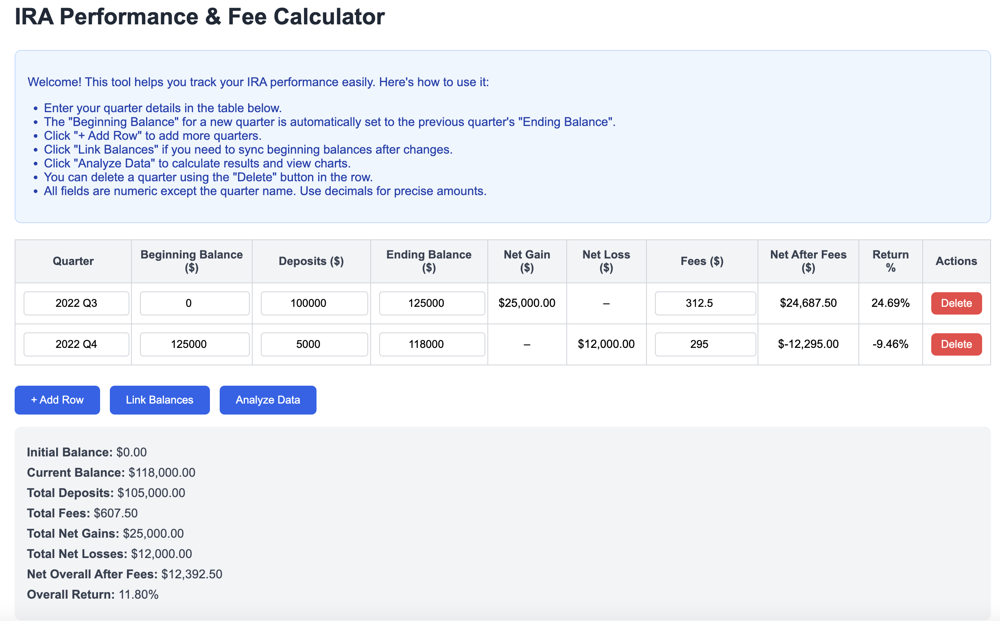
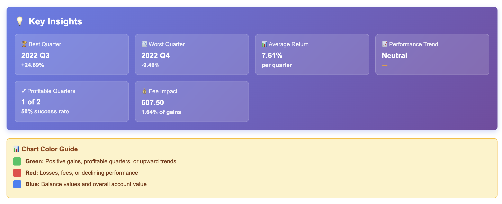
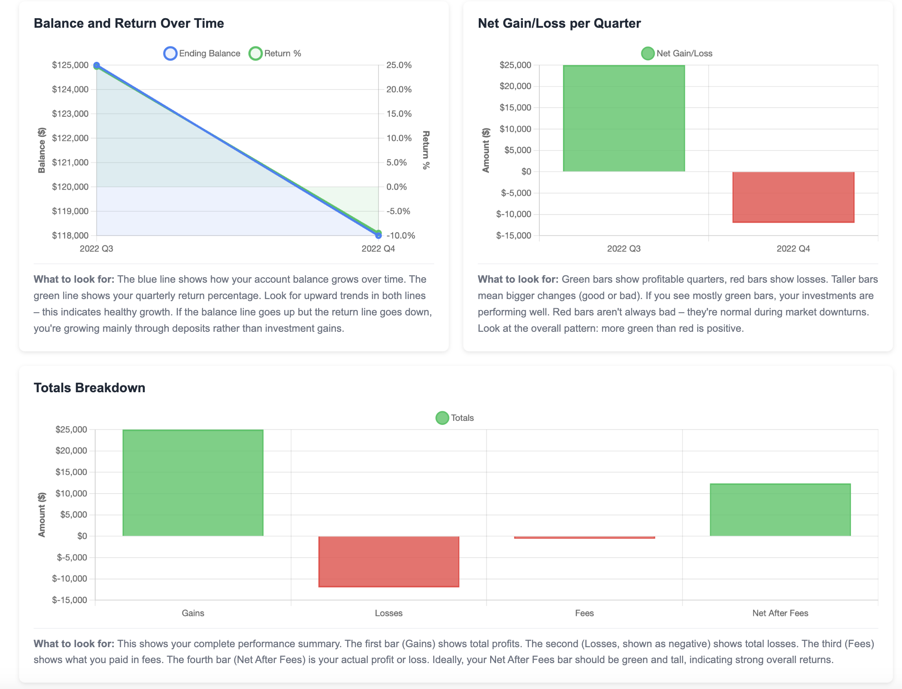
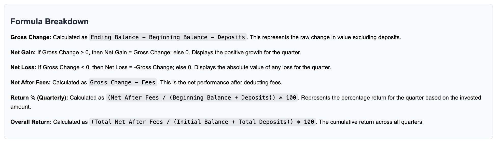

# IRA Performance & Fee Calculator


## 🚀 Overview

This is a user-friendly, client-side **web application** designed to simplify tracking and analyzing **Individual Retirement Account (IRA)** investments. It automates calculations for quarterly performance metrics like balances, deposits, gains, losses, fees, and returns.

I built this tool to help my uncle move away from error-prone, time-consuming manual spreadsheets for monitoring his retirement portfolio. Now hosted on **GitHub Pages**, he uses it regularly to gain clear insights into his investments.

The app runs **entirely client-side** in the browser, ensuring **data privacy**—no information is ever sent to a server. It's built with vanilla web technologies for simplicity and ease of maintenance.

---

## 💡 Features

- **Dynamic Input Table**: Easily add, edit, or delete quarters. Fields include quarter name, beginning balance, deposits, ending balance, and fees. It auto-calculates **net gain/loss**, **net after fees**, and **return %** for each row.
- **Balance Synchronization**: The "**Link Balances**" button automatically sets each quarter's beginning balance to the previous ending balance, with warnings for mismatches.
- **Summary Metrics**: Displays overall totals including initial/current balance, total deposits/fees/gains/losses, net after fees, and the crucial **cumulative return %**.
- **Interactive Charts** (via Chart.js):
    - Balance and Return Over Time (line chart with dual axes).
    - Net Gain/Loss per Quarter (color-coded bar chart).
    - Totals Breakdown (bar chart summarizing cumulative performance).
- **Key Insights Dashboard**: Analyzes the data to highlight best/worst quarters, average return, performance trends, profitable quarter rate, and the impact of fees in visually appealing cards.
- **User Guidance**: Includes in-app instructions, tooltips on table headers, **formula breakdowns**, chart color legends, and descriptive notes for non-technical users.
- **Robust Error Handling**: Validates inputs, prevents invalid operations (e.g., deleting the last row), and handles edge cases like zero divisions.
- **Responsive Design**: Works seamlessly on desktop and mobile devices.

---

## 📸 Screenshots

### Main Interface


### Charts and Insights



### Formula Breakdown


---

## 🛠 Technologies Used

- **HTML5**: Core structure and forms.
- **CSS3**: Styling, responsive layouts, gradients, and shadows.
- **JavaScript (Vanilla)**: Core logic, DOM manipulation, calculations, and event handling.
- **Chart.js**: For dynamic, interactive data visualizations.
- **No frameworks** or external dependencies beyond the Chart.js library (loaded via CDN).

---

## ⬇️ Installation and Usage

### Live Demo

You can access the application directly via GitHub Pages:

[**Live Demo**]([https://chehrehmi.github.io/Portfolio_Caclulator/])

### Local Setup

No installation is required! Just open the `index.html` file in any modern web browser.

1. Clone the repository:
    ```bash
    git clone [https://github.com/Chehrehmi/Portfolio_Caclulator.git](https://github.com/Chehrehmi/Portfolio_Caclulator.git)
    ```
2. Navigate to the project directory:
    ```bash
    cd Portfolio_Caclulator
    ```
3. Open `index.html` in your browser.

### How to Use

1.  Enter your IRA quarter details (Name, Balances, Deposits, Fees) in the table.
2.  Use the "**+ Add Row**" button for new quarters.
3.  Click "**Analyze Data**" to compute the results, generate charts, and view the insights dashboard.
4.  *Optional*: Use "**Link Balances**" to auto-sync the beginning balance of a quarter with the ending balance of the previous one.

**Remember:** All data is processed *in-browser* and is **not** saved or uploaded.

---

## 🛣 Development Story

The project was born from a real need: simplifying IRA tracking for a non-technical family member. I prototyped a basic calculator and rapidly iterated based on his direct feedback, leading to the addition of crucial features like the insights dashboard and visualizations. Development took about **two days** part-time, with a strong focus on usability. The main challenges were ensuring chart responsiveness across devices and building robust handling for various data edge cases.

---

## 🌟 Future Enhancements

-   CSV import/export functionality for data backup.
-   Annual rollups and future projections.
-   Dark mode toggle for improved aesthetics.
-   Integration with a mock API to load sample data for demonstration.

---

## 🤝 Contributing

Contributions are always welcome! Feel free to fork the repository and submit a pull request with your improvements.

---


## ✉️ Contact

| Platform | Handle |
| :--- | :--- |
| **GitHub** | [@https://github.com/Chehrehmi/](https://github.com/Chehrehmi/) |
| **Email** | jeremymathewjose@gmail.com |

If you find this tool useful, please **star the repo** or share your feedback! 🚀
